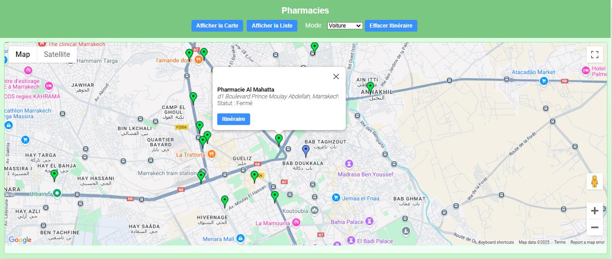
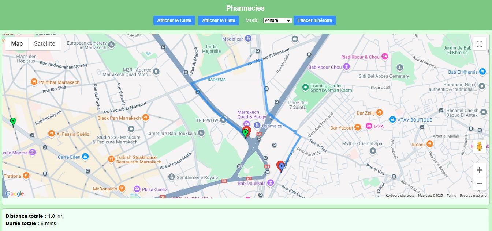
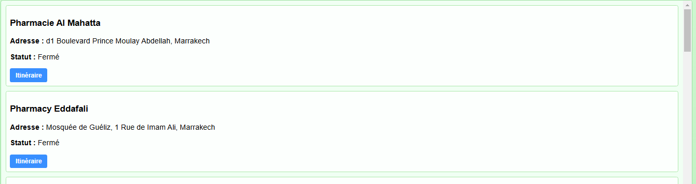

# Pharmacies à proximité

Application web qui localise les pharmacies les plus proches de l'utilisateur grâce au GPS de son appareil, les affiche sur une carte et calcule l'itinéraire pour s'y rendre.

Elle répond à un besoin concret : trouver rapidement une pharmacie, notamment en situation d'urgence ou dans une ville que l'on ne connaît pas. Elle s'appuie sur l'API de géolocalisation du navigateur et sur les services Google Maps Platform (Maps, Places, Directions).



## Fonctionnalités

- **Géolocalisation de l'utilisateur** : la position actuelle est détectée via le GPS et affichée sur la carte (marqueur bleu).
- **Pharmacies à proximité** : les pharmacies situées dans un rayon de 10 km sont affichées avec des marqueurs verts.
- **Fiche de chaque pharmacie** : un clic sur un marqueur affiche le nom, l'adresse et le statut (ouvert / fermé).
- **Calcul d'itinéraire** : le bouton « Itinéraire » trace le trajet vers la pharmacie choisie, avec la distance et la durée estimée.
- **Choix du mode de transport** : voiture, à pied, vélo ou transports en commun.
- **Vue liste** : « Afficher la liste » affiche sous la carte la liste des pharmacies les plus proches, chacune avec son bouton « Itinéraire ».
- **Effacer l'itinéraire** pour revenir à la vue d'ensemble.
- **Interface responsive**, utilisable sur mobile, tablette et ordinateur.

### Calcul d'itinéraire



### Vue liste



## Technologies

| Domaine | Outils |
|---|---|
| Front-end | HTML5, CSS3, JavaScript |
| Cartographie | Google Maps JavaScript API |
| Recherche de lieux | Google Places API (Nearby Search) |
| Itinéraires | Google Directions API |
| Localisation | API Geolocation du navigateur (GPS de l'appareil) |

**Pourquoi le GPS ?** C'est le capteur le plus précis pour la localisation, et il est intégré en standard dans tous les smartphones. Il permet aussi de travailler concrètement sur l'intégration d'API de cartographie et sur les calculs de distance.

## Structure du projet

```
Pharmacie/
├── index.html      # Page principale, chargement de l'API Google Maps
├── script.js       # Logique : géolocalisation, recherche, marqueurs, liste, itinéraire
├── styles.css      # Mise en forme et responsive
├── package.json
├── bike.png        # Icônes des modes de transport
├── car.avif
├── commun.png
└── pieton.png
```

## Installation et lancement

### 1. Obtenir une clé API Google

L'application utilise Google Maps Platform. Chacun doit utiliser sa propre clé, et donc ses propres quotas et sa propre facturation.

1. **Créer un projet** sur la [Google Cloud Console](https://console.cloud.google.com/) : connectez-vous, puis créez un projet ou sélectionnez-en un existant.
2. **Activer les API** dans *API et services → Bibliothèque* :
   - Maps JavaScript API
   - Places API
   - Directions API
3. **Configurer la facturation** dans *API et services → Facturation*. Google offre un crédit mensuel gratuit, mais une carte bancaire est demandée. Vérifiez que la facturation est bien associée au projet.
4. **Créer la clé** dans *API et services → Identifiants → Créer des identifiants → Clé API*.
5. **Sécuriser la clé** : limitez son usage à vos domaines ou adresses IP, et aux trois API utilisées.

### 2. Intégrer la clé

Dans `index.html`, remplacez `VOTRE_CLE_API` par votre clé, dans la balise qui charge l'API Google Maps :

```html
<script
  src="https://maps.googleapis.com/maps/api/js?key=VOTRE_CLE_API&libraries=places&callback=initMap"
  async
  defer>
</script>
```

Gardez le paramètre `libraries=places`, nécessaire à la recherche de lieux, et `callback=initMap`.

> **Ne publiez jamais votre clé API dans un dépôt public.** Remplacez-la par `VOTRE_CLE_API` avant chaque commit.

### 3. Lancer l'application

Servez le dossier avec un serveur local, puis ouvrez la page dans le navigateur, par exemple :

```bash
npx serve .
```

Un serveur local (`localhost`) est recommandé : la géolocalisation du navigateur n'est autorisée que dans un contexte sécurisé, et certains navigateurs la bloquent lorsque la page est ouverte directement depuis un fichier. Autorisez l'accès à votre position quand le navigateur le demande.

### 4. Vérifier le fonctionnement

Vérifiez que la carte s'affiche et que la recherche et l'itinéraire fonctionnent. En cas d'erreur (`InvalidKeyMapError`, `ApiNotActivatedMapError`…), contrôlez que :

- la facturation est active ;
- les trois API (Maps, Places, Directions) sont activées ;
- les restrictions de la clé autorisent votre domaine ou `localhost`.

## Réutiliser l'application pour d'autres lieux

La logique principale (carte, marqueurs, pagination des résultats, liste, itinéraire) ne dépend pas du type de lieu recherché. Pour localiser des hôtels, des supermarchés ou des restaurants, il suffit de modifier le champ `type` de la requête *Nearby Search* dans `script.js` :

```js
const request = {
  location: location,
  radius: 10000,
  type: ["pharmacy"]   // remplacer par "lodging", "supermarket", "restaurant"…
};

service.nearbySearch(request, (results, status, pagination) => {
  // ...
});
```

La liste des types acceptés (`restaurant`, `bank`, `atm`, `cafe`, `gas_station`…) est disponible dans la [documentation de Google Places API](https://developers.google.com/maps/documentation/places/web-service/supported_types).

Quelques ajustements optionnels :

- **Textes affichés** : remplacer « Pharmacie sans nom » par « Hôtel sans nom », ou adapter le libellé « Statut (Ouvert / Fermé) » s'il n'est pas pertinent.
- **Icône des marqueurs** : remplacer l'icône verte par une icône adaptée (une valise pour un hôtel, un caddie pour un supermarché…).
- **Rayon et filtres** : ajuster `radius`, ou ajouter des filtres comme `minprice` et `maxprice`.

## Limites et pistes d'amélioration

**Limites actuelles**

- Les **pharmacies de garde** ne sont pas encore identifiées : leurs données ne sont pas fournies par Google Places et nécessiteraient une source dédiée.
- La **précision de la géolocalisation** se dégrade en intérieur.
- La fiabilité des **horaires d'ouverture** dépend des données Google.

**Pistes d'amélioration**

- Intégrer une source fiable pour les pharmacies de garde et la mise à jour des horaires.
- Se connecter aux systèmes de réservation ou de commande en ligne des pharmacies.
- Mettre à jour la carte automatiquement en temps réel.
- Ajouter le multilingue.
- Recueillir les retours des utilisateurs pour améliorer l'application.

## Ce que ce projet m'a apporté

- Le développement web front-end en HTML, CSS et JavaScript.
- L'intégration d'API externes (Maps, Places, Directions) et la gestion de leurs clés et quotas.
- La manipulation de la géolocalisation et des calculs de distance et d'itinéraire.

## Auteur

**Souhaib Temsamani**
